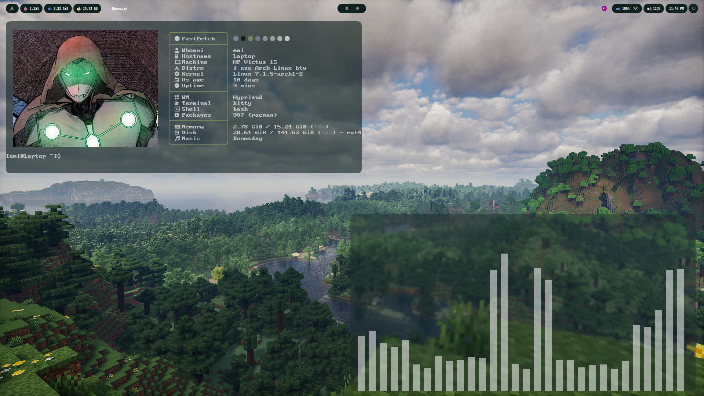

this are my dotfiles in this moment im using waybar for the superior bar and hyprland for my apps also im using pywal to generate the colors.

### Fastfetch image
My fastfetch image is in dotfiles/fastfetch/images/ as infamous.jpg, the Infamous Iron Man image is from Pinterest because I’m not currently reading the series, and besides, I only own the first comic in physical format.

### Wallpaper
You can find my wallpaper in dotfiles/Wallpapers/ as minecraft.png along with other wallpapers, I got the Minecraft one from r/wallpapers on Reddit.

### Other
also if you see too much , on my readme is because i use the transaltor to confirm that I wrote it correctly

### Important
Thanks for checking out my dotfiles, they're simple, but I like them : )
